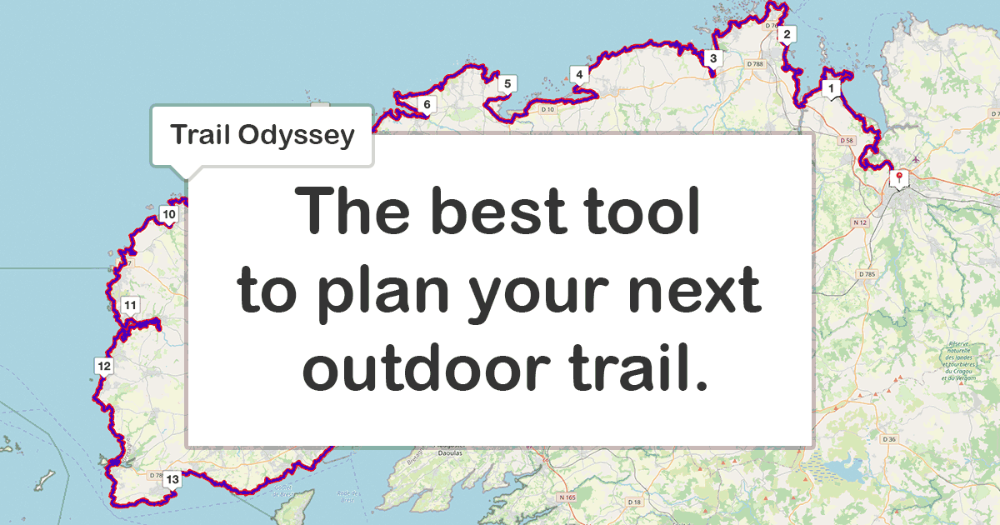
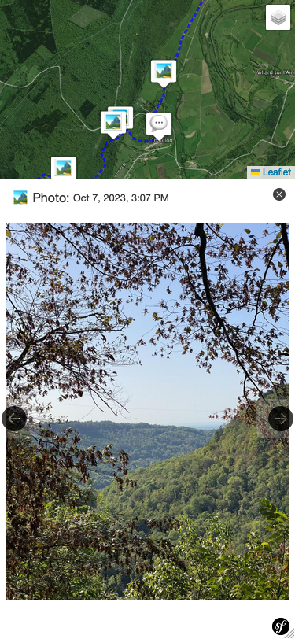
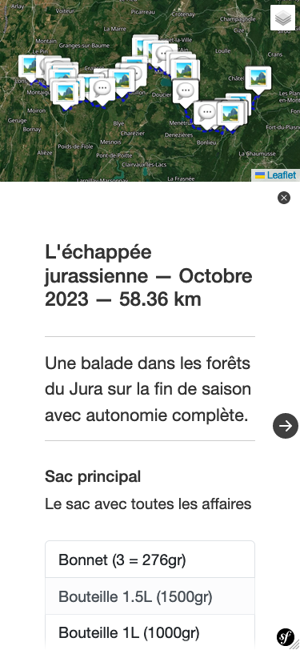
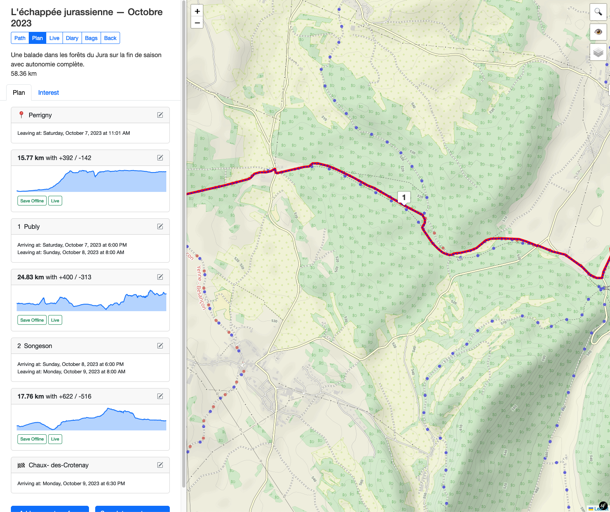
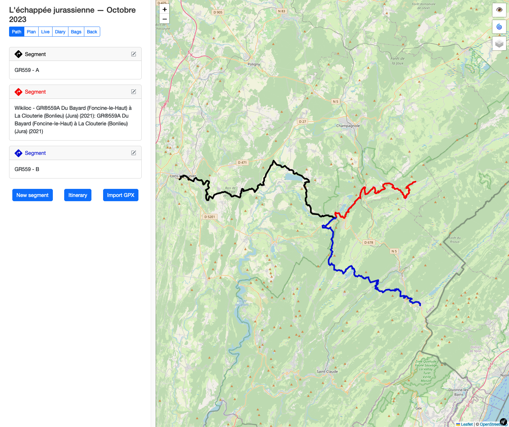
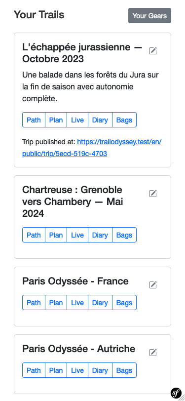
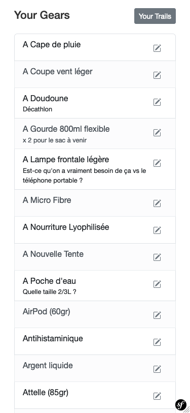
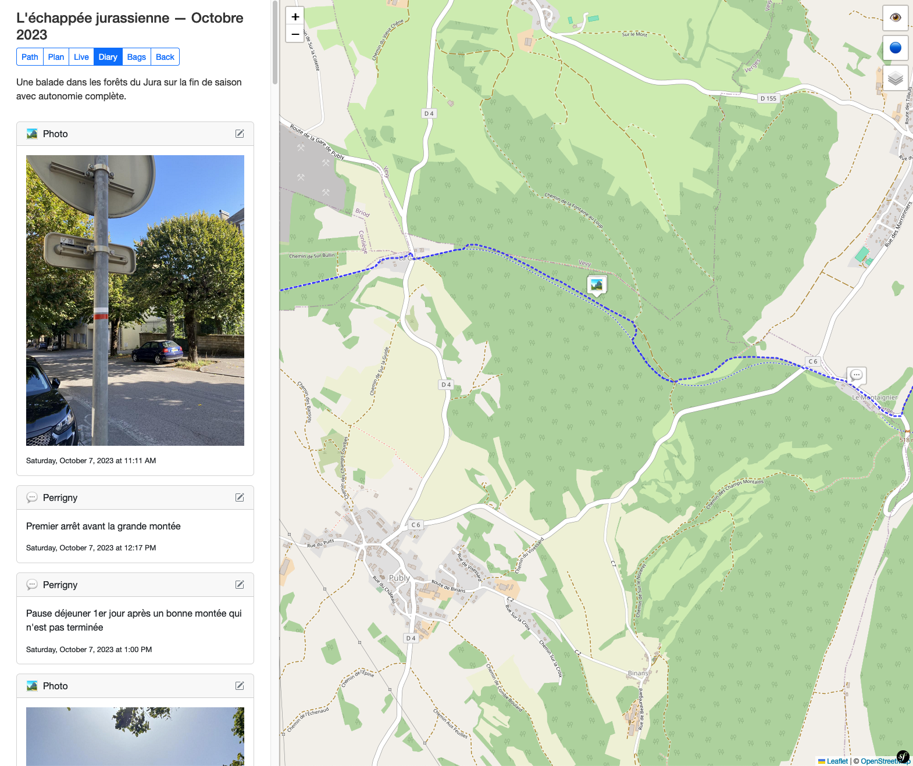
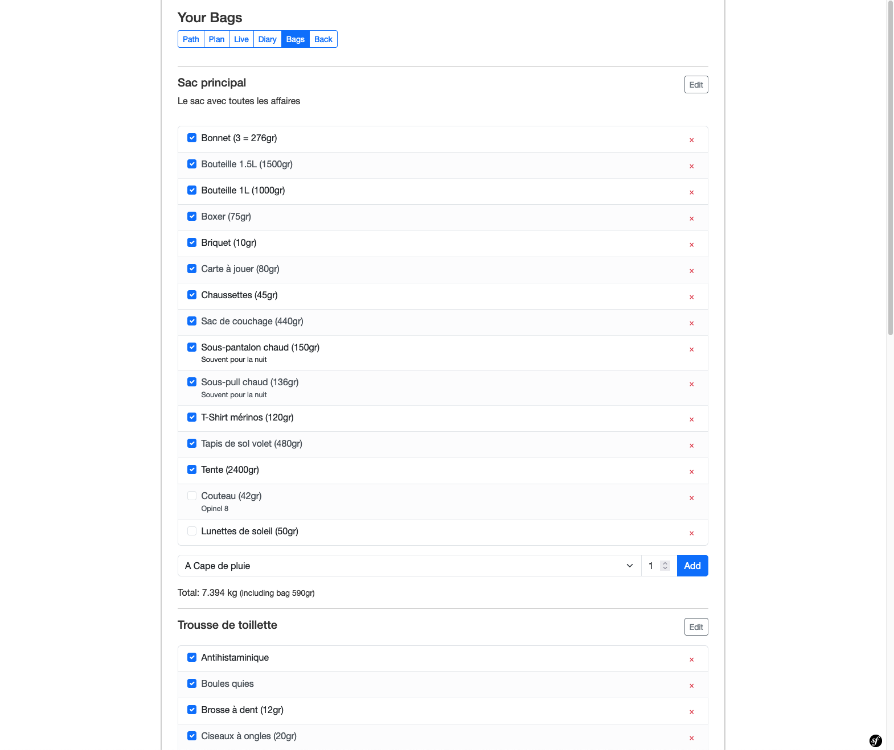

# Trail Odyssey


[This introduction comes from my blog](https://jerome.gangneux.net/2024/04/15/trail-odyssey/)

What is Trail Odyssey?

It’s a website that allows you to plan hikes from A to Z.

And what do I mean by that:

- The creation of the path itself, that is to say importing GPX or creating routes (even if needed by tracing point-to-point segments), managing your base maps.
- Planning the hike, namely placing the stages, studying altitudes, looking for points of interest (water or viewpoint for example).
- Preparing your bag, including weight management.
- Export of the final GPX to import it into external apps if necessary.
- And finally share photos of the itinerary with a public version for your friends.


## Technical choices

Trail Odyssey is developed for mobile first.

More technical details in the form of keywords: PHP, Symfony, Javascript, Turbo, LeafletJS, BoostrapCSS, PWA, Mobile First.


## Technical Concepts

### Stage and Routing relation

```
-----------
| Stage A |
-----------
  !__ Routing AB __
                  !
            -----------
            | Stage B |
            -----------
```

Stage have two dates:
- arriving at (the date and time where you plan to arrive at this destination)
- leaving at (the date and time where you plan to leave from this destination)

Stage have 0, 1 or 2 routing(s):
- routing in
- routing out

Routing have two stages:
- start stage
- finish stage

So in this schema:
- Stage A has one routing out: Routing AB
- Routing AB has two stages; start stage: Stage A and finish stage: Stage B
- Stage B has one routing in: Routing AB

### Other concepts

`Mappable` is anything that can be shown on the map

**TODO**

 - Explain: the use of turbo frames templates
 - Explain: Load JS on DOMContentLoaded and re-used when Turbo frame is re-rendered via
`{{ stimulus_js_load_start('diaryController', first_load is defined and first_load) }}`


## Installation

### Prerequisite 

 - Adds `127.0.0.1 trailodyssey.test` into your `/etc/hosts` file
 - Install [castor](https://castor.jolicode.com/)

### First time install

 - `castor infra:build` There nothing to build for now but still
 - `castor infra:up`
 - `castor infra:install`
 - `castor dev:load-fixture` For dev

Head up to https://trailodyssey.test and you should have a running instance!

### Day to day commands

 - `castor up` to start the project
 - `castor down` to stop the project

See `castor` for other commands

### Deploy with Coolify

To deploy with Coolify:
- Create a new project with a MySQL and a Redis resource
- Then add TrailOdyssey repository as your source
- Use the Docker Compose build pack 
- Use `/docker-compose-coolify.yml` for docker compose location
- Click continue
- Add your domain
- Check option: Configuration > General > Build > Preserve Repository During Deployment
- Add pre and post deploy scripts: 
  - `castor deploy:pre` with php-fmp as image 
  - `castor deploy:post ; chown -R www-data ./var` with php-fmp as image 
- Activate shared network with docker compose: Configuration > Advanced > Network > Connect To Predefined Network
- Fill up the Environments Variables, including the one from Redis and MySQL resource
- In Configuration > Storage, switch nginx.conf to file mount
- Start the deploy

### Mastodon app

I you want, you can create a Mastodon app so the user could publish Diary automatically.

You have to go on the Mastodon instance you want to allow, in Settings > Applications and create a new App with those info:

 - Application name: Trail Odyssey
 - Application website: https://trailodyssey.net
 - Redirect URI:  
   urn:ietf:wg:oauth:2.0:oob  
   https://trailodyssey.net/account/user/connect/mastodon/code
 - Scopes: profile write 

You should adapt the url so it matches your Trail Odyssey instance.

Then you can do that for multiple Mastodon instances.

In your `env` you would have this kind of entries:

```yaml
MASTODON_INSTANCES=instance_x.net,instance_y.social
MASTODON_CLIENT_KEYS=x_key,y_key
MASTODON_CLIENT_SECRETS=x_secret,y_secret

```

urn:ietf:wg:oauth:2.0:oob
https://square-lively-labrador.ngrok-free.app/account/user/connect/mastodon/code
https://trailodyssey.net/account/user/connect/mastodon/code

## User manual

The user manual is a work in progress, still those are hidden features that needs to be explicit:

- On desktop, you can hold the _shift_ key while hovering elevation so the map moves at that point
- On desktop, you can hold the _shift_ key and click on the name of a segment to make it fit the view
- After a search of any kind, simply click on the map to discard the last results


### Geo JSON

#### Retrieving

Geo JSON is a standard format to display information from files on a map. 
But the standard does not explicit a way to retrieve those files.
So TrailOdyssey tries its best to get the data, but it may fail sometimes.

#### Styling

Geo JSON is a standard format to display information from files on a map.
But the standard does not explicit a way to style this data.

TrailOdyssey allows you to add styling information when configuring your Geo JSON source.

You must use a valid JSON with at least one of those two key: `marker` and/or `popup` 
that will define the content and style of the marker and the popup.

 - The `marker` MUST be a structured json representing an HTML tree that will be your point marker. You can also use `%tag` to use the content on the current feature.
 - The `popup` MUST be a structured json representing an HTML tree that will be your point popup. You can also use `%tag` to use the content on the current feature.

**example**
```json
{
  "marker": {
    "el": "div",
    "style": "width: 100px; background: white; color: black; font-weight: bold; padding: .3rem; text-align: center;",
    "content": "%properties.city%"
  },
  "popup": {
    "el": "div",
    "style": "background: yellow;",
    "class": "small",
    "children": [
      {
        "el": "ul",
        "children": [
          {
            "el": "li",
            "content": "%properties.city%"
          },
          {
            "el": "li",
            "content": "%properties.temp% °C"
          }
        ]
      }
    ]
  }
}
```

So we have multiples ways of doing it and sometime we need a tricks to make it work.
`bbox={x}/{y}/{z}`

## Some screens



Public: Display of photos with the position on the map, mobile first (but a desktop version exists)



Public: Public sharing home page with mileage and bag summary



Planning: Display of the different stages, elevation differences, desired dates and times. Desktop version (available in mobile)



Path: display of paths coming either from multiple GPXs, or from routes traced by hand or via the tool integrated into Trail Odyssey. Desktop version (available in mobile)



Main page with all hikes



Equipment page, with the list of equipment. From this page, you can add elements (with their weight) to find them in bag management later



"Diary" part which allows you to add geotagged photos and texts, for the public version



Bag management: Adding items, managing multiple bags, bags within bags and total weight. The checkboxes allow you to prepare your bag and not forget anything.


## Resources

- [symfony.com/ux-turbo](https://symfony.com/bundles/ux-turbo/current/index.html#accelerating-navigation-with-turbo-drive)
- [stimulus](https://stimulus.hotwired.dev)
- [graphp/graph](https://github.com/graphp/graph)
- [graphp/algorithms](https://github.com/graphp/algorithms)
- [sibyx/phpGPX](https://sibyx.github.io/phpGPX/)
- [leafletjs.com/reference](https://leafletjs.com/reference.html)
- [mpetazzoni/leaflet-gpx](https://github.com/mpetazzoni/leaflet-gpx)
- [overpass api](https://overpass-api.de)
- [overpass turbo](https://overpass-turbo.eu)
- [wiki.openstreetmap.org/Nominatim/Special_Phrases](https://wiki.openstreetmap.org/wiki/Nominatim/Special_Phrases)
- [wiki.openstreetmap.org/Overpass_API](https://wiki.openstreetmap.org/wiki/Overpass_API)
- [wiki.openstreetmap.org/Tag:tourism:camp_site](https://wiki.openstreetmap.org/wiki/Tag:tourism%3Dcamp_site)
- [thunderforest maps outdoors](https://www.thunderforest.com/maps/outdoors/)
- [leaflet routing machine](https://github.com/perliedman/leaflet-routing-machine)
- [turfjs.org/docs/](https://turfjs.org/docs/)
- [Leaflet.GeometryUtil](https://makinacorpus.github.io/Leaflet.GeometryUtil/global.html#length)
- [getbootstrap.com](https://getbootstrap.com/docs/5.3/layout/grid/)
- [icons.getbootstrap.com](https://icons.getbootstrap.com/)


## Licence

Code, and assets are under Apache License 2.0


## Contributing

Trail Odyssey aims to be an Open Source, community-driven project. Join us by contributing code or documentation.
